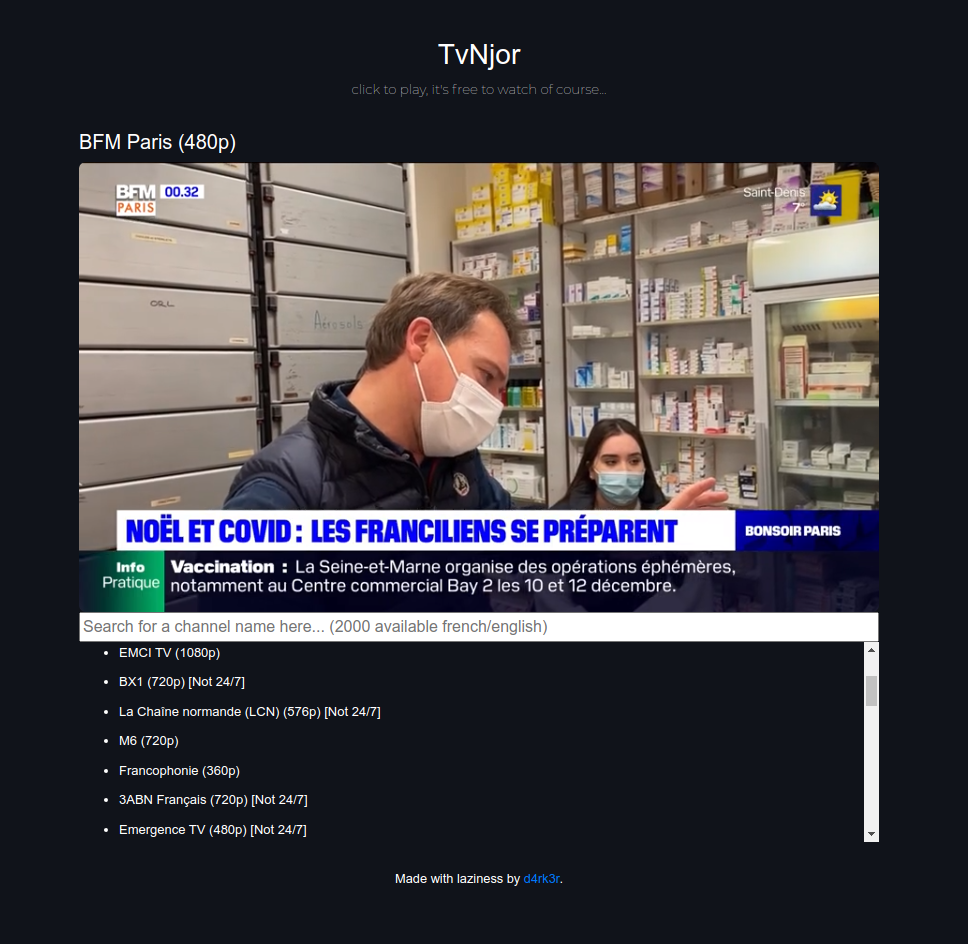

# TvNjorr

boff... an m3u8 web player 

## Requirements

- python3
- npm

## To install
```
git clone ...
npm install -g http-server
pip install m3u-parser

# To generate new links
# It's optional, 
# run it only if you want to re-fetch tv links
python parser.py
```

## To launch
```
cd path/to/tvnjorr
bash start.sh
# the web app will be available on 
# http://127.0.0.1:2938/
```

## Screenshot


Note : Am not responsible of the bad use of this project, it was made for viwers only !
